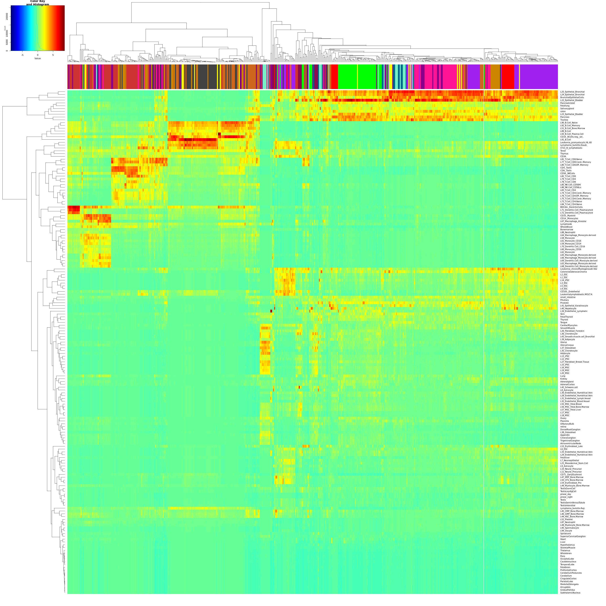

To knit this RMarkdown: Ctrl+Shift+K

## Reference Component Analysis of breast cancer single cell RNA-seq data 

In this project, we are interested in the application of the recent clustering method "Reference Component Analysis" on a breast cancer scRNA-seq dataset. Breast cancer is comprised of multiple molecular subtypes that are defined based on the expression of Estrogen and Progesterone receptors, as well as HER2 receptors. In their work, Chung et al (2017) obtained scRNA-sequencing data from 549 cells from 11 breast cancers patients with different molecular subtypes. Our aim is to assess the performance of RCA on this new dataset and compare our results to the findings obtained by Chung et al. We were particular interested in exploring the tumor heterogeneity in different breast cancer molecular subtypes.

```{r global.options, include = TRUE}
### Set global and markdown global options
knitr::opts_chunk$set(
    cache       = TRUE,     # if TRUE knitr will cache the results to reuse in future knits
    fig.path    = './Imagestoup/',  # file path to the directory where knitr shall store the graphics files
    echo        = TRUE,    # in FALSE knitr will not display code in the code chunk above it's results
    message     = FALSE,     # if FALSE knitr will not display any messages generated by code
    strip.white = TRUE,     # if FALSE knitr will not remove white spaces at the beg or end of code chunk
    warning     = FALSE)    # if FALSE knitr will not display any warning messages in the final document

```

Figure 1: Figure taken from Chung et al paper showing fomalin-fixed carcinoma and non-carcinoma cells from the 11 breast cancer samples 
```{r fig.align='left',out.width="50%"}
library(knitr)


```

```{r}
### installation of the RCA packages
### Please download the packages for the first time:
#install.packages("remotes")
#remotes::install_github("GIS-SP-Group/RCA")
### Install packages for the first time:
#install.packages("BiocManager") 
#BiocManager::install("WGCNA")
#BiocManager::install("DropletUtils")
### loading libraries
library(WGCNA)
library(flashClust)
library(gplots)

library(preprocessCore)
library(RCA)
library(dplyr)
library(RColorBrewer)
library(ggplot2)
library(ggpubr)
library(stringr)
library(DropletUtils)
library(scales)
library(stringr)
library(forcats)
### setting options
options(stringsAsFactors = FALSE)
options(knitr.duplicate.label = "allow")
```

- Download the count RNA-seq data in TPM (Transcripts per million base) format and save in `data` directory:
Already loaded in the ../data folder!
```{bash}
cd ../data
ls 
#wget https://ftp.ncbi.nlm.nih.gov/geo/series/GSE75nnn/GSE75688/suppl/GSE75688_GEO_processed_Breast_Cancer_raw_TPM_matrix.txt.gz
```

- Load in the TPM data:
```{r}
tpm_data = read.csv("../data/GSE75688_GEO_processed_Breast_Cancer_raw_TPM_matrix.txt",row.names = 1,sep = "\t")
head(tpm_data)
```

- Annotation: To get the exact format required by RCA for rownames (Gene should be presented as GenomeLocation_HGNCGeneName_EnsembleID for example: chr1:43766663-43788779_TIE1_ENSG00000066056.9 ), we convert our TPM data with rownames in that format by using BioMart conversion tool

```{r}
# Read in the annotation file downloaded from Biomart for conversion of Ensemble ID and UCSC Chr:str-end format with gene names
anno_data = read.csv("../data/annotation_biomart.txt",sep="\t",header=1)
colnames(anno_data) <- c("gene_name","start","chr","end","ENS_ID")
anno_data
# Changing into required format from RCA package
anno_data_new <- anno_data %>% 
  mutate(anno = paste0("chr",chr, ":",start,"-",end,"_",gene_name,"_",ENS_ID))
head(anno_data_new)
rownames(anno_data_new) <- anno_data_new$ENS_ID
anno <- anno_data_new[6]
anno
```


- Changing the tpm_data with correct format of rowname (gene) `GenomeLocation_HGNCGeneName_EnsembleID` and filter to have only single cells and good QC cells, remove cells with low number of transcripts (Supplementary Materials of paper)
```{r}
filter_tpm <- merge(tpm_data,anno,by=0)
head(tpm_data)
filter_tpm <- filter_tpm[,c(-1,-2,-3)]
rownames(filter_tpm) <- filter_tpm$anno
filter_tpm <- subset(filter_tpm, select = -c(anno) )
# Remove pooled and tumor samples and keep only single cells
filter_tpm <- filter_tpm[,-c(1:14)]
# Cells are discarded with Quality Control when having low number of transcripts 
cell_discard <- read.csv("../data/Discarded_Cells.csv",header = FALSE)$V1
head(cell_discard)
filter_tpm <- filter_tpm[,-which(names(filter_tpm) %in% cell_discard)]
head(filter_tpm)
```


## Section 1: Creation of Annotation Dataframe for samples according to patients or molecular pathology states
```{r}
sample <- colnames(filter_tpm)
number <- sapply(strsplit(sample, "_"), tail, 1)
rep <- sapply(strsplit(sample, "_"), "[[", 2)
patient <- sapply(strsplit(sample, "_"), head, 1)
sample_annotation <- data.frame("sample"=sample,"patient"=patient,"number"=number,"rep" = rep)
sample_annotation$rep[sample_annotation$rep != "Re"] <- 1
sample_annotation$rep[sample_annotation$rep == "Re"] <- 2
head(sample_annotation)

# Create color palette
#head(colors())
cl <- colors(distinct = TRUE)
set.seed(15) # to set random generator seed
mycols <- c("red","green", "orange3", "gray26" , "deeppink" , "purple" , "yellow" , "darkmagenta", "chocolate3" , "aquamarine2" , "brown3","deepskyblue4", "deeppink4")
palette(mycols)
sample_annotation$col <- palette(mycols)[factor(sample_annotation[,"patient"])]
sample_annotation$patho[sample_annotation$patient %in% c("BC01" , "BC02")]<- "Luminal_A"
sample_annotation$patho[sample_annotation$patient == "BC03"]<- "Luminal_B"
sample_annotation$patho[sample_annotation$patient == "BC03LN"]<- "Luminal_B_LN"
sample_annotation$patho[sample_annotation$patient %in% c("BC04" ,"BC05","BC06")]<- "HER2"
sample_annotation$patho[sample_annotation$patient %in% c(paste0("BC0",c(7:9)),paste0("BC",c(10,11)),"BC07LN")] <- "TBNC"
sample_annotation$patho[sample_annotation$patient == "BC07LN"] <- "TBNC_LN"

set.seed(158) # to set random generator seed
mycols2 <- sample(cl, 6)
palette(mycols2)
sample_annotation$col_patho = palette(mycols2)[factor(sample_annotation[,"patho"])]
sample_annotation
#unique(sample_annotation$col_patho)
#write.csv(sample_annotation,file="sample_annotation.csv")
```


## Section 2: Clustering the single-cell data: Run RCA analysis on Global panel
### Section 2a: No Normalization 
```{r}
### construct data object
data_obj = dataConstruct(filter_tpm);
dim(data_obj$tpm)
#head(data_obj)
### filter out lowly expressed genes
data_obj = geneFilt(obj_in = data_obj);

### normalize gene expression data (Note: default is no normalization).
data_obj = cellNormalize(data_obj);
### log transform the data
data_obj = dataTransform(data_obj,"log10");
### project the expression data into Reference Component space
data_obj = featureConstruct(data_obj,method = "GlobalPanel");
### generate cell clusters
data_obj = cellClust(data_obj)

```

..cutHeight not given, setting it to 0.992  ===>  99% of the (truncated) height range in dendro.
 ..done.


### Section 2b: Normalization, scQ normalization 

```{r}
### construct data object
data_obj_norm = dataConstruct(filter_tpm);
#head(data_obj_norm)
### filt out lowly expressed genes
data_obj_norm = geneFilt(obj_in = data_obj_norm);
### normalize gene expression data (Note: default is no normalization).
data_obj_norm = cellNormalize(data_obj_norm, method = "scQ");
### log transform the data
data_obj_norm = dataTransform(data_obj_norm,"log10");
### project the expression data into Reference Component space
data_obj_norm = featureConstruct(data_obj_norm,method = "GlobalPanel");
### generate cell clusters
data_obj_norm = cellClust(data_obj_norm)
```

..cutHeight not given, setting it to 1.04  ===>  99% of the (truncated) height range in dendro.
 ..done.

## Section 3: Assessing effect of Normalization on the data
```{r}

### After normalization, a new tpm matrix was generated. We created two dataframes of the TPM values before and after normalization. 
dataobj_tpm <- data.frame(data_obj$normed_fpkm)
dataobj_norm_tpm <- data.frame(data_obj_norm$normed_fpkm)

#Counted the number of cells analyzed per patient
numbercellperpatient = str_split(colnames(dataobj_tpm), "_") %>%
  sapply("[[", 1)
numbercellperpatient_norm = str_split(colnames(dataobj_norm_tpm), "_") %>%
  sapply("[[", 1)

table(numbercellperpatient)
table(numbercellperpatient_norm)

### Created two new dataframes which contains the mean TPM and the number of detected genes per cell. 
summary_beforenorm = data.frame(
  cell_name = colnames(dataobj_tpm),
  Patient = numbercellperpatient,
  Mean_TPM = colMeans(dataobj_tpm),
  num_genes = colSums(dataobj_tpm != 0)
)

summary_afternorm = data.frame(
  cell_name = colnames(dataobj_norm_tpm),
  Patient = numbercellperpatient_norm,
  Mean_TPM =colMeans(dataobj_norm_tpm),
  num_genes = colSums(dataobj_norm_tpm != 0)
)


### Find the mean TPM and the mean number of genes detected for each patient.

summary_beforenorm_perpatient = summary_beforenorm %>%
  dplyr::group_by(Patient) %>%
  dplyr::summarise(mean_MeanTPM = mean(Mean_TPM),
                   num_genes_mean = mean(num_genes))

summary_afternorm_perpatient = summary_afternorm %>%
  dplyr::group_by(Patient) %>%
  dplyr::summarise(mean_MeanTPM = mean(Mean_TPM),
                   num_genes_mean = mean(num_genes))


### Created histogram representing the sum of the TPMs and the number of genes detected for each cell, grouped by patient. 

### Histogram: Number of genes detected in each cell before normalization, grouped by patient
num_genes_beforenorm <- ggplot(summary_beforenorm,
       aes(x = num_genes/1000, colour = Patient, fill = Patient)) +
  geom_histogram(aes(y = ..density..), colour = "black", fill = "white", bins = 10) +
  geom_density(alpha = 0.4) +
  geom_vline(data = summary_beforenorm_perpatient ,
             aes(xintercept = num_genes_mean/1000),
             colour = "blue", linetype = "dashed", size = 0.5) +
  labs(title = "Histogram of number of genes expressed per cell, grouped by patient, before normalization",
       x = "Number of the genes expressed (in thousands)",
       y = "density") +
  theme(plot.title = element_text(size=9)) +
  facet_wrap(~ Patient, ncol = 3)

png("number_gene_beforenorm.png")
print(num_genes_beforenorm)   
dev.off()


### Histogram: Mean TPM each cell before normalization, grouped by patient
MeanTPM_beforenorm <- ggplot(summary_beforenorm,
       aes(x = Mean_TPM, colour = Patient, fill = Patient)) +
  geom_histogram(aes(y = ..density..), colour = "black", fill = "white", bins = 10) +
  geom_density(alpha = 0.2) +
  geom_vline(data = summary_beforenorm_perpatient ,
             aes(xintercept = mean_MeanTPM),
             colour = "blue", linetype = "dashed", size = 0.5) +
  labs(title = "Histogram of the mean TPM per cell, grouped by patient, before normalization",
       x = "Mean TPM",
       y = "density") +
  theme(plot.title = element_text(size=9)) +
  facet_wrap(~ Patient)

png("MeanTPM_beforenorm.png")
print(MeanTPM_beforenorm)   
dev.off()


### Histogram: Mean TPM each cell after normalization, grouped by patient
MeanTPM_afternorm <- ggplot(summary_afternorm,
       aes(x = Mean_TPM, colour = Patient, fill = Patient)) +
  geom_histogram(aes(y = ..density..), colour = "black", fill = "white", bins = 10) +
  geom_density(alpha = 0.2) +
  geom_vline(data = summary_afternorm_perpatient,
             aes(xintercept = mean_MeanTPM),
             colour = "blue", linetype = "dashed", size = 0.5) +
  labs(title = "Histogram of the mean TPM per cell, grouped by patient, after normalization",
       x = "Mean TPM",
       y = "density") +
  theme(plot.title = element_text(size=9)) +
  theme(axis.text.x = element_text(angle = 45, hjust = 1, size = 7)) +
  facet_wrap(~ Patient)

png("MeanTPM_afternorm.png")
print(MeanTPM_afternorm)   
dev.off()

```

Figure 2: Histograms generated using data from TPM matrices prior and after normalization (Genes detected per cell, and mean TPM per cell). 
```{r, fig.align="left",out.width="50%"}

```

## Section 3: Editing of the RCAPlot function source code
Here we don't use the integrated function RCAPlot but our modified version to:
- add cluster_color_label, cluster_shape_label to assess patient-specific or batch effect and color by molecular pathology groups
- Change the outfile name so it is customizable
- Save in PDF instead of png for higher resolution

```{r}
RCAPlot <- function(rca_obj,point_cex=1,cluster_color_labels=NULL,cluster_shape_labels=NULL,outfile=NULL){
  
  #if (!require("WGCNA")) install.packages("WGCNA",repos = "http://cran.us.r-project.org") 
  if (!require("gplots")) install.packages("gplots",repos = "http://cran.us.r-project.org")
#  if (!require("colorRamp")) install.packages("colorRamp",repos = "http://cran.us.r-project.org") 
  require(gplots)
  require(WGCNA)
#  require(colorRamp)
    data(sysdata, envir=environment())
    
    c = rca_obj$dynamicColors;
    pr = prcomp(t(scale(rca_obj$fpkm_for_clust))); 
    pc_projection = as.data.frame(pr$x);
    cell_projection = pc_projection[,1:2];
    pch_to_use = 21;
    cex_to_use = point_cex;
# Color by just cluster numbers
  pdf(sprintf("RCAplot_PCA_RCA_clusters_%s.pdf",outfile))
  main_name = "PCA of cell clusters in RCA space by cluster numbers";
  #par(mar=c(1,1,1,1)*7)  
  plot(cell_projection[,1],cell_projection[,2],
       type="p",pch = pch_to_use,
       xlab = colnames(cell_projection)[1],ylab = colnames(cell_projection)[2],
       col = c,lwd = 1,bg = c,
       main = main_name, cex = cex_to_use, cex.main = 1,
       font.axis = 1, font.lab = 1, font.main = 1
      );
  dev.off();
  png(sprintf("RCAplot_heatmap_RCA_clusters_%s.png",outfile),width = 3000, height = 3000, pointsize = 15);
  color_scheme =     colorRampPalette(c("#00007F", "blue", "#007FFF", "cyan",
                       "#7FFF7F", "yellow", "#FF7F00", "red", "#7F0000"))(100);
  heatmap.2(as.matrix(rca_obj$fpkm_for_clust),col=color_scheme,
          Colv=as.dendrogram(rca_obj$cellTree),
          ColSideColors=c,
           scale="none", margins=c(5,20),
           trace="none",
           key = TRUE,
           keysize = 0.5,
           cexCol = 1,cexRow =1,
           labCol = "",
          main = sprintf("RCAplot_heatmap_RCA_clusters_by_cluster_numbers_%s.png",outfile)
           )  
  dev.off();
# Giving color pallete and shape define by users 
  if ( !is.null(cluster_color_labels)){
    png(sprintf("RCAplot_heatmap_external_labels_%s.png",outfile),width = 3000, height = 3000, pointsize = 15);
    color_scheme = colorRampPalette(c("#00007F", "blue", "#007FFF", "cyan",
            "#7FFF7F", "yellow", "#FF7F00", "red", "#7F0000"))(100);
    heatmap.2(as.matrix(rca_obj$fpkm_for_clust),col=color_scheme,
           Colv=as.dendrogram(rca_obj$cellTree),
           ColSideColors=cluster_color_labels,
           scale="none", margins=c(5,20),
           trace="none",
           key = TRUE,
           keysize = 0.5,
           cexCol = 1,cexRow =1,
           labCol = ""
           )  
    dev.off();
    if (!is.null(cluster_shape_labels)){
      pdf(sprintf("RCAplot_PCA_external_color_shape_labels_%s.pdf",outfile))
    main_name = "PCA of cell clusters in RCA space by batch and patients";
    #par(mar=c(1,1,1,1)*7)  
    plot(cell_projection[,1],cell_projection[,2],
       type="p",pch = cluster_shape_labels,
       xlab = colnames(cell_projection)[1],ylab = colnames(cell_projection)[2],
       col = cluster_color_labels,lwd = 1,bg = cluster_color_labels,
       main = main_name, cex = 0.5, cex.main = 1,
       font.axis = 1, font.lab = 1, font.main = 1
      );
    # Add a legend
    legend("bottomleft", legend = unique(names(cluster_color_labels)), col = unique(cluster_color_labels), cex = 0.4, text.col = "black",fill=unique(cluster_color_labels),pch=21,bg=NULL,border = NULL)
    legend("bottomright", legend = unique(names(cluster_shape_labels)), pch = c(1,2), cex = 0.5, text.col = "black",col="black")
  dev.off();
    }else{
  pdf(sprintf("RCAplot_PCA_external_color_labels_%s.pdf",outfile))
  main_name = "PCA of cell clusters in RCA space";
  #par(mar=c(1,1,1,1)*7)  
  plot(cell_projection[,1],cell_projection[,2],
       type="p",pch = 21,
       xlab = colnames(cell_projection)[1],ylab = colnames(cell_projection)[2],
       col = cluster_color_labels,lwd = 1,bg = cluster_color_labels,
       main = main_name, cex = cex_to_use, cex.main = 1,
       font.axis = 1, font.lab = 1, font.main = 1
      );
  # Add a legend
    legend("bottomleft", legend = unique(names(cluster_color_labels)), col = unique(cluster_color_labels), cex = 0.4, text.col = "black",fill=unique(cluster_color_labels),pch=21,bg=NULL,border = NULL)
  }
  }
}
  
```

## Section 4: RCA Plots
## Section 4a: Colors based on Clusters discovered 
- Non-normalized, no colors assigned.
```{r}
RCAPlot(data_obj,point_cex=1,cluster_color_labels=NULL,cluster_shape_labels=NULL,outfile= "clustering_nonnormalized")
```

- Normalized, no colors assigned.
```{r}
RCAPlot(data_obj_norm,point_cex=1,cluster_color_labels=NULL,cluster_shape_labels=NULL,outfile= "clustering_normalized")
```

##Section 4b: Colors assigned to patient 
- Non-normalized, colors assigned to patient 
```{r}
color_to_use_patient = sample_annotation$col
names(color_to_use_patient) <- sample_annotation$patient
shape_to_use = as.numeric(sample_annotation$rep)
names(shape_to_use) <- paste("batch",sample_annotation$rep,sep="_")
RCAPlot(data_obj,point_cex=1,cluster_color_labels=color_to_use_patient,cluster_shape_labels=shape_to_use,outfile= "colorpatient_nonnormalized")
```

- Normalized, colors assigned to patient 
```{r}
color_to_use_patient = sample_annotation$col
names(color_to_use_patient) <- sample_annotation$patient
shape_to_use = as.numeric(sample_annotation$rep)
names(shape_to_use) <- paste("batch",sample_annotation$rep,sep="_")
RCAPlot(data_obj_norm,point_cex=1,cluster_color_labels=color_to_use_patient,cluster_shape_labels=shape_to_use,outfile= "colorpatient_normalized")
```


## Section 4c: Colors based on molecular subtype
- Non-normalized data:
```{r}       
color_to_use_patho = sample_annotation$col_patho
color_to_use_patho = sample_annotation$col_patho
names(color_to_use_patho) <- sample_annotation$patho
RCAPlot(data_obj,cluster_color_labels = color_to_use_patho,outfile="patho_nonnorm")
```
- Normalized data:
```{r}       
color_to_use_patho = sample_annotation$col_patho
names(color_to_use_patho) <- sample_annotation$patho
RCAPlot(data_obj_norm, cluster_color_labels = color_to_use_patho,outfile="patho_norm")
```


*Figure 3: Principal components PC1 and PC2 of our RCA results 
a. Non-normalized with clustering labels
b. Normalized with clustering labels
c. Non-normalized color by patients
d. Normalized color by patients
e. Non-normalized color by molecular pathology subtypes
f. Normalized color by molecular pathology subtypes

```{r, fig.align="center"}

```


We don't obtain tight clusters but after Normalization, the cluster assigns change insignificantly. 
- Not patient-specific
- No significant batch effect observed

## Section 5: Analyzing the results in biological context

Figure 4: Heatmap with labeling of potential cell types 
```{r, fig.align="left",out.width="50%"}

```

Figure 5: Heatmap of clustering with colors assigned to patients
```{r, fig.align="left",out.width="50%"}

```


Table 1: Table representing the 14 different clusters with their corresponding colors
```{r}
sprintf("Number of clusters if normalize: %s",max(data_obj_norm$group_labels_color[1]))
sprintf("Number of clusters if NOT normalize: %s",max(data_obj$group_labels_color[1]))
print(data.frame(unique(data_obj_norm$group_labels_color[2]),unique(data_obj_norm$group_labels_color[1])))
cluster_labels = data.frame(
  unique(data_obj_norm$group_labels_color[2]),unique(data_obj_norm$group_labels_color[1])
                            )
cluster_labels
```

#### Comment: 

Figure 6: Heatmap of clustering with colors assigned to molecular subtypes 
```{r, fig.align="left",out.width="50%"}

``` 
 


### Results & Discussion: 

In this project, we used RCA to analyze single-cell data from several breast cancer samples of different molecular subtypes. Following scQ normalization, RCA came up with 14 clusters on this data. We obtained more than the 11 clusters that Chung et al found. As described in the original RCA paper published by Prabhakar and his team, we did not observe a significant batch effect for sample/patient BC09 (see figure 3), for which two replicates were run. Regarding the clusters found, they were not patient-specific, but seem to be cell-type specific as shown by Figure 4. We postulate based on the reference transcriptomes found on the right side of Figure 3, that cluster turquoise, lime, brown, bright red (see table 1) correspond to specific subtypes of epithelial cells. Due to a lack of time, we were unable to further dig into the gene expression analysis of those cells to investigate which epithelial subtypes they belong to. However, based on figure 3, it does seem like the bright red cluster could correspond to breast cancer stem cells. In fact, those cells seem to share some features with various types of embryonic stem cells and precursor cells. Very interestingly, this bright red cluster was enriched in cells belonging to patient 5, which has a HER2 positive breast cancer, and is the only patient that isn't treatment naive. Patient 5 has received neoadjuvant chemotherapy and Herceptin prior to resection. This made us think of the cancer stem cell theory: this theory suggests that some cancer stem cells could be inherently resistant to chemotherapy, and be the pool of cells at the source of cancer recurrence. It would have been interesting to investigate the cellular composition of BC05 pre-treatment.Further, no cells from patient 5 were found in clusters corresponding to immune cells. This is in line with what is reported in the literature: chemotherapy does have a depleting impact on immune cells, and this has been reported in breast cancer (Verma et al, 2016). It is therefore likely the lack of infiltrative immune cells is a consequence of chemotherapy. 

Chung et al identified stromal cells using ESTIMATE, which is an algorithm that uses gene expression analysis to calculate tumor score vs immune and stromal scores. The authors didn’t find the identity of those stromal cells. However, using RCA we were able to identify one potential cluster (purple cluster) that could correspond to fibroblasts and that contained around 17 cells. The purple cluster (potential fibroblast cluster) contained mainly cells belonging to patient 8 (BC08). Cells belonging to patients BC07, BC07 LN, BC09 and BC04 were also found in this cluster. BC07, BC07-LN, BC08, BC09 are Triple Negative Breast Cancers, and BC04 is a HER2 positive cancer. No potential fibroblast were found in Luminal A or B cancers. Cancer associated fibroblasts have been shown pro-tumorigenic properties in various cancers by secreting cytokines and growth factors promoting vascularization and EMT. TNBC are known to be very aggressive cancers and have been described in the literature as the breast cancer molecular subtype with the highest propensity to form metastases. Those results are therefore relevant, and it would have been interesting to do a gene expression analysis on those fibroblasts to analyze their potential pro-tumorigenic properties. We do however recognize that 12 cells is a very small number of cells.


Lastly, we initially thought that TNBC had more infiltrating macrophages/ DC and T-cells. However, upon looking more closely we found that this observation was mostly driven by Patient 09 (BC 09). Strikingly, the samples taken from patient 09  were mainly composed of macrophages / DC cells/  T cells, with less than 5 epithelial cells. This was surprising to us, and one may wonder what could have led to such immune infiltration. The authors of the paper chose to run two samples from patient 09 (Rep 01 and Rep 02) - it is possible that they chose to run two replicates because they were as surprised as we were, upon doing CNV analysis. Upon isolating T cells from patient 09, they found two subtypes of T cells: one with an exhaustion signature, and another exhibiting both exhaustion and cytotoxicity signatures. The authors found 10 tumor tissue with T-lymphocyte specific gene expression and immunostaining, but were able to isolate T lymphocytes from only 4 patients (BC03, BC04, BC07 and BC09). On our side, we found potentially two subtypes of T cells, but we were unable to define those subtypes. Using RCA, we were able to only find 5 primary samples, as well as the two samples taken from the lymph nodes with potential T lymphocytes. Using RCA, we found that T cell cluster 1 (dark red) was mainly enriched in cells from BC03 and BC09, whereas cluster 2 (Light Pink) seemed to be more enriched with cells from BC04 and BC07. Concerning the macrophage/ DC infiltration in BC09, the authors did not report it. Not surprisingly, the potential B cell clusters were enriched in cells from the Lymph Nodes metastases from BC03 and BC07. 

In this project, we were unable to find tentative cell-type signatures in distinct molecular subtypes. This is likely due to our small sample - in fact it is important to note that some of our samples had very few cells (as little as 11 cells for BC011). In addition, our inability to find “cell-type signatures” based on molecular subtypes is also probably explained by the high inter-heterogeneity within molecular subtypes. While we were far from coming up with any conclusions, we made some observations that could be worth further investigating. 
In the manuscript, Chung et al used RNAseq inferred CNV to differentiate carcinoma to non carcinoma cells , used estimated to differentiate tumor, immune and stromal cells, and lastly did non-negative factorization clustering with immune cell types specific gene sets to find types of immune cells. RCA has shown to be useful in this dataset. Using almost one step, we were able to find several of the findings described in the manuscript, as well as new observations (CAFs, stem cells in BC05, and macrophages and DC cells in BC09). 

### References: 
Chung W, Eum HH, Lee HO, Lee KM, Lee HB, Kim KT, Ryu HS, Kim S, Lee JE, Park YH, Kan Z, Han W, Park WY. Single-cell RNA-seq enables comprehensive tumour and immune cell profiling in primary breast cancer. Nat Commun. 2017 May 5;8:15081. doi: 10.1038/ncomms15081. PMID: 28474673; PMCID: PMC5424158.
Li H, Courtois ET, Sengupta D, Tan Y, Chen KH, Goh JJL, Kong SL, Chua C, Hon LK, Tan WS, Wong M, Choi PJ, Wee LJK, Hillmer AM, Tan IB, Robson P, Prabhakar S. Reference component analysis of single-cell transcriptomes elucidates cellular heterogeneity in human colorectal tumors. Nat Genet. 2017 May;49(5):708-718. doi: 10.1038/ng.3818. Epub 2017 Mar 20. Erratum in: Nat Genet. 2018 Dec;50(12):1754. PMID: 28319088.
Verma, R., Foster, R.E., Horgan, K. et al. Lymphocyte depletion and repopulation after chemotherapy for primary breast cancer. Breast Cancer Res 18, 10 (2016).


### Reproducibility:
Date and time:
```{r}
format(Sys.time(), 'Last compile on: %d %B, %Y')
```
Version control of packages:
```{r}
installed.packages()[names(sessionInfo()$otherPkgs), "Version"]
sessionInfo()
```
Do not unindent this code but copy paste in Console! (otherwise goes to infinite loops!)
```{r}
#save t .Rdata
#save.image(file="final.RData")
#library(rmarkdown)
#render("cancersysproject_14oct.Rmd", output_format = "html_document")
```

Note: I had trouble with pandoc when knitting the document. If you have this problem, reinstall the update pandoc version 
